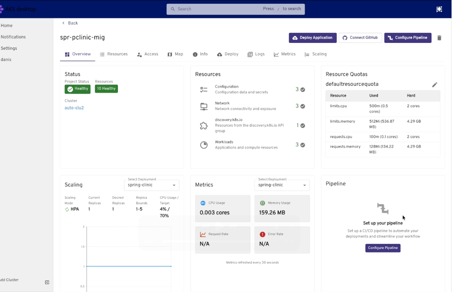

# AKS desktop for Azure Kubernetes Service (AKS)

This article provides an overview of AKS desktop: an application-focused developer portal for Azure Kubernetes Service (AKS) that simplifies application deployment and management without requiring deep Kubernetes expertise. AKS desktop is built on supported AKS features, best practices, and open-source [Headlamp](https://headlamp.dev/).

To install AKS desktop, see the [AKS desktop GitHub repository](https://github.com/Azure/aks-desktop/releases).

> [!IMPORTANT]
> AKS desktop abstracts Kubernetes complexity but doesn't remove access. You can still use kubectl, YAML, or other existing tools alongside AKS desktop.

## What is AKS desktop?

Kubernetes workflows often require writing and maintaining YAML, switching between tools (kubectl, dashboards, monitoring), and an understanding of low-level infrastructure concepts.

AKS desktop simplifies this process using [**Projects**](#projects-in-aks-desktop), which group everything your application needs into a single, manageable unit, and provides guided workflows for deploying, monitoring, scaling, and troubleshooting applications.

AKS desktop works within your existing environment and tools, including Visual Studio Code, GitHub, and CI/CD pipelines. It connects to your existing AKS clusters and supports multi-environment scenarios across dev, test, staging, and production, including Azure hybrid and edge deployments.

## Projects in AKS desktop

Projects are the primary units for managing applications in AKS desktop. A Project groups related Kubernetes resources, such as deployments, services, and configuration, into a single logical unit.

Projects make it easier to:

- Understand application boundaries.
- Manage access using RBAC.
- View all resources in one place.
- Attribute ownership of Kubernetes and Azure resources and manage costs.

The following table compares Projects in AKS desktop to Kubernetes Namespaces, which are a more traditional way to group resources in Kubernetes:

| Concept | AKS desktop Project | Kubernetes Namespace |
| ------- | ------------------- | -------------------- |
| Purpose | Application-level grouping | Resource isolation |
| Abstraction level | High (developer-friendly) | Low (infrastructure-focused) |
| Mapping | Typically 1:1 | Native Kubernetes concept |

## Key capabilities

The following table summarizes the key capabilities of AKS desktop that help development teams deploy and manage applications on AKS without deep Kubernetes expertise:

| Capability | Description |
| ---------- | ----------- |
| **Application-centric management** | Focus on applications instead of individual Kubernetes resources. Projects group deployments, services, and config into a single unit. |
| **Guided workflows** | Deploy, scale, and update applications without writing Kubernetes manifests. |
| **Unified observability** | View logs, metrics, health status, and dependency maps in one place. |
| **Natural language troubleshooting** (preview) | Ask questions in natural language to diagnose and resolve issues in your cluster. Uses the [AKS Agentic CLI agent](agentic-cli-for-aks-overview.md) and AKS MCP server to access live cluster state, logs, events, and metrics within your existing Role-Based Access Control (RBAC) boundaries. Use a hosted model or bring your own. |
| **Insights** (preview) | eBPF-based deep observability using [Inspektor Gadget](https://inspektor-gadget.io/) without requiring code changes, pod restarts, or sidecars. Includes **Processes** (CPU, memory, I/O per pod), **Trace TCP** (live connection events), and **Trace DNS** (query failures, latency). |
| **Multi-cluster & multi-environment support** | Manage applications across dev, test, staging, and production on Azure, hybrid, and edge clusters. |
| **Role-based access control** | Delegate access at the Project level using Azure RBAC. |
| **Existing tool integration** | Integrates with Visual Studio Code, GitHub, CI/CD pipelines, and the terminal. Existing kubectl and YAML workflows remain available. |
| **Built on AKS best practices** | Built on supported AKS features including AKS Deployment Safeguards, Managed Prometheus, and Entra ID authentication. |

## Who is AKS desktop for?

AKS desktop is designed for development teams who want to deploy and manage applications on AKS without needing deep Kubernetes expertise. This includes:

- **DevOps and platform engineers** who want to:
  - Provide a simplified interface for developers to manage applications and their resources.
  - Delegate access using guardrails and RBAC.
  - Manage multiple clusters and applications with a consistent experience.
- **Application developers** who want to:
  - Deploy and update applications without writing Kubernetes manifests.
  - Debug issues using logs, metrics, live tracing, and visualizations.
  - Observe, scale, and monitor applications in real time.

## Frequently asked questions (FAQ)

### I'm already using Headlamp. How is AKS desktop different?

AKS desktop is built on Headlamp but includes additional features, integrations, and support specifically for AKS. AKS desktop provides a more opinionated and streamlined experience for deploying and managing applications on AKS, with features like Projects, guided workflows, unified observability, and natural language troubleshooting.

### Can I manage existing applications with AKS desktop?

Yes, you can import them into AKS desktop. For more information, see [Import existing namespaces into AKS desktop Projects](aks-desktop-install-cluster-setup.md#use-existing-namespace--importing-existing-namespaces-into-aks-desktop-projects).

### Can I view all the deployed resources outside of AKS desktop?

Yes. Once you deploy your application, you can view it using other Kubernetes tools.

### Does AKS desktop support Standard AKS clusters?

AKS desktop supports Standard AKS clusters that meet specific requirements. For more information, see [New and existing AKS Standard clusters](aks-desktop-install-cluster-setup.md#new-and-existing-aks-standard-clusters).

## Related content

Get started with AKS desktop using the following resources:

- [AKS desktop quickstart](aks-desktop-quickstart-auto.md)
- [AKS desktop cluster setup and requirements](aks-desktop-install-cluster-setup.md)
- [Set up permissions for AKS desktop](aks-desktop-permissions.md)
- [Deploy an application with AKS desktop](aks-desktop-app.md)
- [Troubleshoot an application using Insights (preview)](aks-desktop-deploy-troubleshooting.md)
- [Use the AI troubleshooting assistant (preview)](aks-desktop-deploy-ai-assistant.md)
