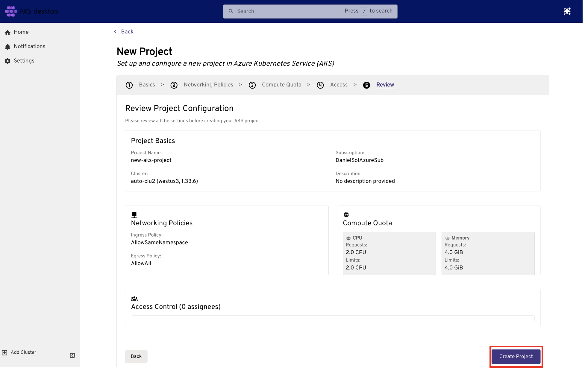
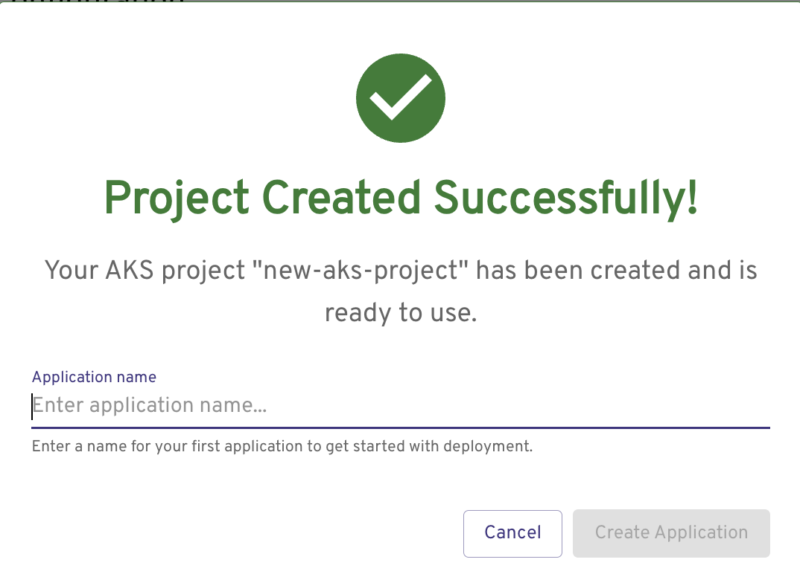
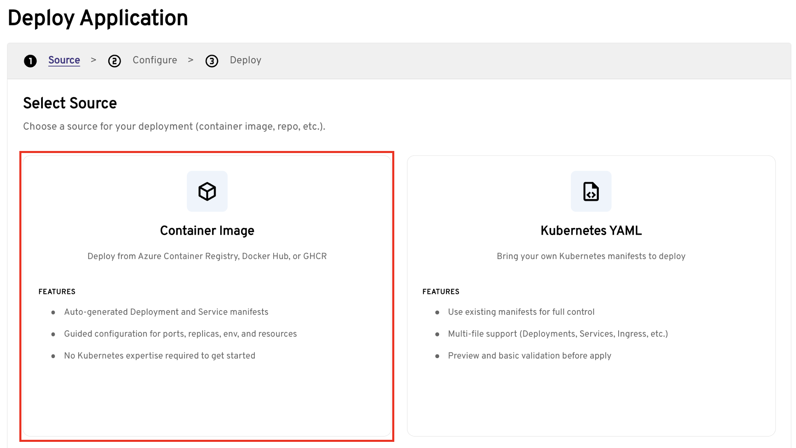
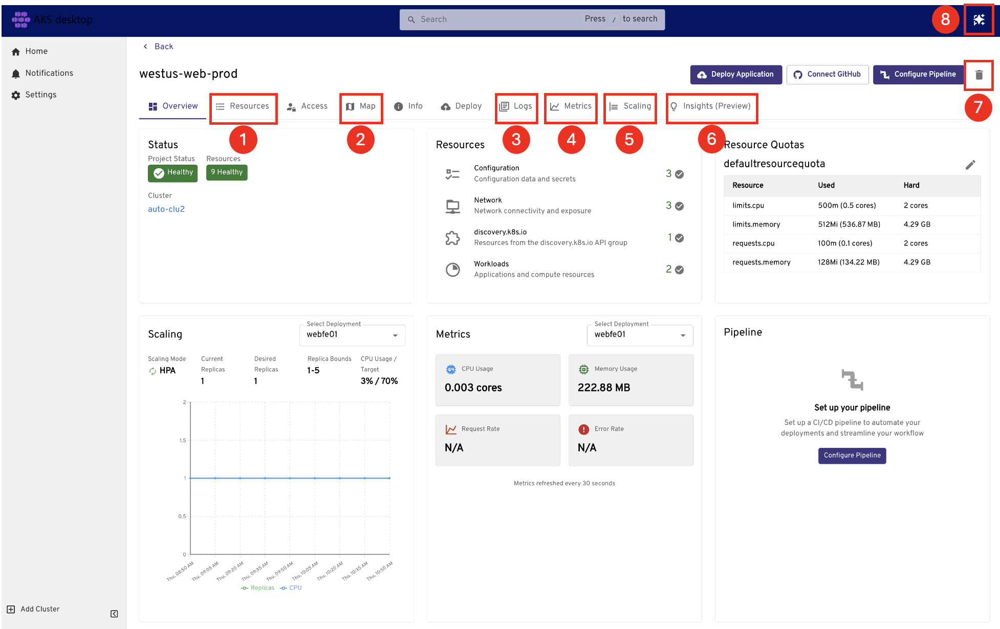

# Quickstart: Deploy and Managed application using AKS desktop

Deploying and managing Kubernetes applications typically requires writing YAML manifests, running kubectl commands, and switching between multiple tools. AKS desktop removes this complexity with guided workflows that let developers and DevOps engineers deploy, monitor, troubleshoot, and clean up applications without deep Kubernetes expertise.

This guide walks you through deploying a TypeScript application using AKS desktop, from creating a cluster through exploring application logs, metrics, scaling, and built-in troubleshooting tools.

## Prerequisites

- You need an Azure subscription. If you don't have an Azure subscription, you can create a free [Azure account](https://azure.microsoft.com/free).
- Azure CLI version 2.64.0 or later must be installed. Check your version using the [`az --version`](/cli/azure/reference-index#az-version) command. To install or upgrade, see [Install Azure CLI](/cli/azure/install-azure-cli).
- The `aks-preview` Azure CLI extension. Install it using the `az extension add --name aks-preview` command.
- You must install [AKS desktop](https://github.com/Azure/aks-desktop/releases). AKS desktop supports the following operating systems: Windows, Linux, and Mac.
- Your cluster must be Microsoft Entra ID authenticated. To ensure your cluster is Microsoft Entra ID authenticated, use an [AKS Automatic cluster](intro-aks-automatic.md).
- You must have the **Azure Kubernetes Service RBAC Cluster Admin** role on the target cluster, or equivalent permissions.

> [!NOTE]
> If you create a new AKS cluster and Azure Container Registry (ACR) in step 1, compute and ACR Build task charges apply. Review [AKS pricing](https://azure.microsoft.com/pricing/details/kubernetes-service/) before proceeding.

## Steps

1. **Register your AKS cluster**
    If you don't have an existing AKS cluster and Azure Container Registry (ACR), run the following commands:
      ```bash
         # set vars
         RAND=$RANDOM
         export RAND
         echo "Random resource identifier will be: ${RAND}"
         myResourceGroup=bbash$RAND
         myLocation=westus3
         myClusterName=clu-$RAND
         registryName=bbashreg$RAND


         # create rg
         az group create --name $myResourceGroup --location $myLocation

         # create acr
         az acr create --resource-group $myResourceGroup --name $registryName --sku Basic

         # create cluster & attach acr
         az aks create --resource-group $myResourceGroup --name $myClusterName --sku automatic --attach-acr $registryName

         # get cluster resource ID
         AKS_ID=$(az aks show --resource-group $myResourceGroup --name $myClusterName --query id --output tsv)

         # grant yourself admin permission to the cluster
         az role assignment create --role "Azure Kubernetes Service RBAC Cluster Admin" \
            --assignee <your-entra-id> \
            --scope $AKS_ID

         # create a container image for testing — note the ACR and image name for use in step 6
         mkdir myapp
         cd myapp
         git clone https://github.com/Azure-Samples/contoso-air
         cd contoso-air/src/web
         az acr build --resource-group $myResourceGroup --registry $registryName --image contosoair:v1 .
         ```

2. Select **Add from Azure Subscription**.
   - Enter the name of your Azure subscription if you have more than one. (Alternatively, select the arrow to open the drop-down list, then select your Azure subscription.)
   - Select your cluster, then select **Register Cluster**.

      

3. **Create a New Managed Project**
   - Go to the **Projects** tab and select **Create a New Managed Project**.
   - Walk through the steps:
      - Basics
         - Project Name: `my-dev-frontend`
         - Subscription: `<your-subscription-name>`
         - Cluster: `<your-cluster-name>`
         > [!NOTE]
         > When set the Azure subscription and AKS cluster, AKS desktop checks for cluster and subscription feature support required for the AKS desktop experience.

      - Networking Policies—You can leave this default. To expose the application publicly, change **Ingress** to `Allow all traffic`.
      - Compute Quota-leave default for the test application.
      - Access-add a colleague if you wish or delete the entry by deleting the line item.
      - Review > Create Project

         


4. **Deploy the Application**
   - Post Project creation, you can immediately deploy an app!
         
   - Provide an application name
   
5. **Select Source**
      

6. **Configure Deployment**
   - Accept the defaults unless you want to customize.
   - Add your container image name from step 1, for example: `myacr.azurecr.io/contosoair:v1`

   > [!IMPORTANT]
   > You cannot use the `latest` tag. Specify an explicit tag such as `v1`.

   - Networking
      - Target port: For the example container, set it to `3000`.
      - Enable public access — set if you want to access the application from a public URL.
   - HPA (Horizontal Pod Autoscaler)
      - Enable Horizontal Pod Autoscaler

7. **Deploy and verify**
   - Select **Deploy**.
   - The Project overview shows the deployment status. Wait until all resources show a healthy state.
   

8. **Explore the application**

   Use the tabs in the Project view to explore your running application:

   - **Resources**—view all Kubernetes resources for the application
   - **Map**—visualize how all the Kubernetes resources interact and depend on each other
   - **Logs**—see the pod logs
   - **Metrics**—view core application resource consumption
   - **Scaling**—view scaling events and make updates
   - **Insights**—troubleshoot DNS failures, network traffic, and resource usage (preview). See [Troubleshoot an application using Insights](aks-desktop-deploy-troubleshooting.md).
   - **Delete**—delete the project
   - **AI assistant**—use natural language to diagnose and resolve issues in your cluster (preview). See [Use the AI troubleshooting assistant](aks-desktop-deploy-ai-assistant.md).

9. **Clean up**—to remove the project, select **Delete** and if you want to remove the underlying Azure Managed Namespace Resource, select **Also delete the namespaces**. 

## Next steps

- [Troubleshoot an application using Insights (preview)](aks-desktop-deploy-troubleshooting.md)
- [Use the AI troubleshooting assistant (preview)](aks-desktop-deploy-ai-assistant.md)
- [Set up permissions for AKS desktop](aks-desktop-permissions.md)

## Related content

- [AKS desktop overview](aks-desktop-overview.md)
- [Set up a cluster for AKS desktop](aks-desktop-install-cluster-setup.md)
- Learn how to [Deploy an application with AKS desktop](aks-desktop-app.md)


